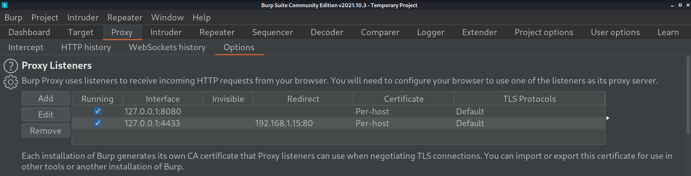
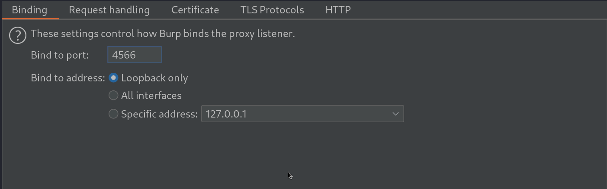
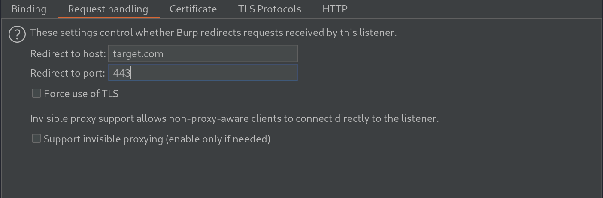
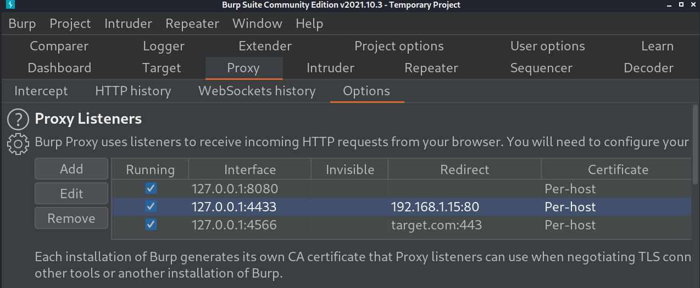
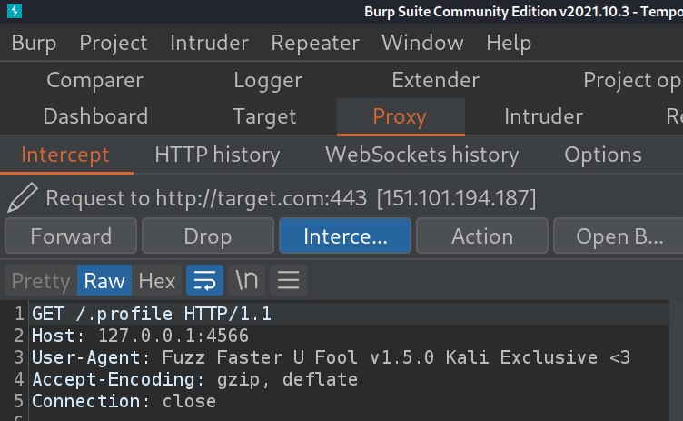

# ffuf
ffuf is a fest web fuzzer written in Go that allows typical directory discovery, virtual host discovery (without DNS records) and GET and POST parameter fuzzing.

Fuzzing is the practice of entering large amounts of unexpected inputs and recording what happens.

## necessary options

| Option  | Description | Example |
| ------------- | ------------- | ------------- |
| `-u`  | Target URL  |`ffuf -u http://10.10.71.16/FUZZ -w SecLists/Discovery/Web-Content/raft-medium-files-lowercase.txt`|
| `-w` |  Wordlist file path and (optional) keyword separated by colon.  |`/path/to/wordlist:KEYWORD`  `ffuf -u http://10.10.71.16/PUB -w SecLists/Discovery/Web-Content/raft-medium-files-lowercase.txt:PUB`|
|`-b`|Cookie data for copy as curl functionality|`Format: "NAME1=VALUE1; NAME2=VALUE2"`|
|`-r`|Follow redirects (default: false)|`ffuf -u http://192.168.1.15/FUZZ -w /usr/share/wordlists/dirb/common.txt -r`|
|`-recursion`|Scan recursively. Only FUZZ keyword is supported, and URL (-u) has to end in it.|`ffuf -u http://192.168.1.15/FUZZ -w /usr/share/wordlists/dirb/common.txt -recursion`|
|`-recursion-depth`|Maximum recursion depth.(default: 0)|`ffuf -u http://192.168.1.15/FUZZ -w /usr/share/wordlists/dirb/common.txt -recursion --recursion-depth 2`|
|`-c`|Colorize output. (default: false)||
|`-p`|Seconds of delay between requests, or a range of random delay.|`ffuf -u http://192.168.1.15/FUZZ -w /usr/share/wordlists/dirb/common.txt -p "1-1.2"`|
|`-v`| Verbose output, printing full URL and redirect location (if any) with the results. (default: false)|`ffuf -u http://192.168.1.15/FUZZ -w /usr/share/wordlists/dirb/common.txt -v `|
|`-mc`|Match HTTP status codes, or "all" for everything. (default: 200,204,301,302,307,401,403,405)|`ffuf -u http://192.168.1.15/FUZZ -w /usr/share/wordlists/dirb/common.txt -v -mc 200`|
|`-fc`|Filter HTTP status codes from response. Comma separated list of codes and ranges|`ffuf -u http://192.168.1.15/FUZZ -w /usr/share/wordlists/dirb/common.txt -v -mc 403`|
|`-o`|Write output to file|`ffuf -u http://192.168.1.15/FUZZ -w /usr/share/wordlists/dirb/common.txt -o ffuf-report.html`|
|`-of`|output file format. Available formats: json, ejson, html, md, csv, ecsv (or, 'all' for all formats) (default: json)|`ffuf -u http://192.168.1.15/FUZZ -w /usr/share/wordlists/dirb/common.txt -of html -o report.html`|
|`-e`|Comma separated list of extensions. (NOTE:Extends FUZZ keyword.) in other word add extensions to end of out word list.|`ffuf -u http://192.168.1.15/FUZZ -w /usr/share/wordlists/dirb/common.txt -e .php,.txt,.bak`  `ffuf -u http://192.168.1.15/FUZZ -w /usr/share/wordlists/dirb/common.txt -e _version`|
|`-H`|add line in header request (necessary for bug bounties) separated by colon. Multiple -H flags are accepted.`format:"Name: Value"` `"Name: Value,Name2: Value2"`|`ffuf -u http://192.168.1.15/FUZZ -w /usr/share/wordlists/dirb/common.txt -H "agent: whiteowl,job: pentester"`|

### useful examples
two wordlist:(subdomain and content) 
`ffuf -u http://W1.test.com/W2 -w /usr/share/wordlists/SecLists/Discovery/DNS/subdomains-top1million-5000.txt:W1 -w /usr/share/wordlists/SecLists/Discovery/Web-Content/raft-large-files.txt:W2`

parameter fuzzing: 
`ffuf -w /path/to/paramnames.txt -u https://target/script.php?FUZZ=test_value -fs 4242`

dictionary for parameters in Seclist:
`SecLists/Discovery/Web-Content/burp-parameter-names.txt`

### intercept ffuf traffic with burp:

1)open burp and go in Proxy > Options > Proxy Listeners 

2)add Burp bind address and port in Binding tab 

3)add target address and port in Request handling tab 

4)click ok and see the result 

5)intercept proxy and fireup burp 
`ffuf -v -u http://127.0.0.1:4433/FUZZ -w /usr/share/wordlists/dirb/common.txt` 

